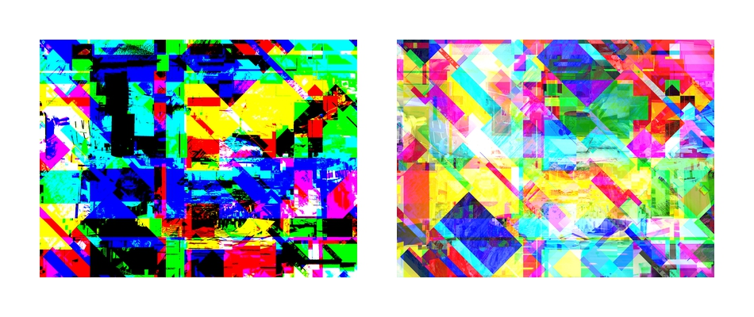
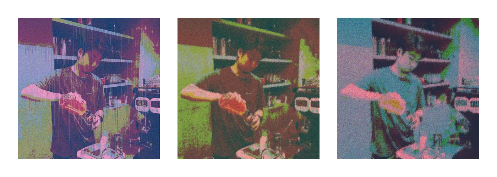

# Study-Glitch  

### About Glitch  

グリッチ | 現代美術用語辞典ver.2.0
[http://artscape.jp/artword/index.php/%E3%82%B0%E3%83%AA%E3%83%83%E3%83%81](http://artscape.jp/artword/index.php/%E3%82%B0%E3%83%AA%E3%83%83%E3%83%81)

---  

### index  

- BinaryGlitch-0xEE  
- Glitch-OpenCV  

---  

### BinaryGlitch-0xED  

バイナリエディタを使ってグリッチさせる。  
データそのものを壊す。  

  

画像を .bmp ファイルに保存して、バイナリ文字列をいじる。  
動画でやるなら、連番の静止画の文字列編集を、bash ファイルか何かで繰り返させる？  

jpg の方が良い（悪い） or TiF の方が良い（悪い） 、いろいろ説がある  

---  

### Glitch-OpenCV  

OpenCV を使って、ピクセルの色情報をいじって（擬似）グリッチさせる。  

i X j の行列で、各ピクセルを洗う。  
if 文で、条件分岐を作れるので、多様な表現が可能（多分）  

[workflow.md](https://github.com/naysok/Study-Glitch/blob/master/Glitch-OpenCV/Glitch-video/workflow.md)

---  

### Ref.  

ucnv  
[https://ucnv.org/](https://ucnv.org/)  

修論でグリッチとかデータベンディングについて調べたので、少しまとめを書いときます。  
[http://kenko.web6.jp/blog/?p=245](http://kenko.web6.jp/blog/?p=245)  

Mac のターミナルだけを使ってグリッチ画像アートを楽しむ方法  
[https://karaage.hatenadiary.jp/entry/20130620/1371742416](https://karaage.hatenadiary.jp/entry/20130620/1371742416)  